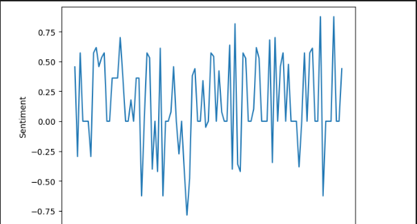

# Python Sentiment Analysis

NLTK sentiment analysis basics in Python notebook 2024

Based on some Financial Tweets from Kaggle:
https://www.kaggle.com/datasets/davidwallach/financial-tweets

We use NLTK, Pandas and Matplotlib to identify the overall sentiment to the Netflix stock over a period of time. Values greater than 0 are positive, and less than 0 are negative.



## Requirements 📜

- Python 3.11++
- nltk

Optional:

- Bash terminal
- Visual Studio Code

## Setup 🔧

When running this codebase, it was originally coded on a Windows 11 machine with Python 3.12.4 using Visual Studio Code.

You can check your version with: `python --version`

You will want to setup a Python environment in VSC. To do this:

- Ctrl + Shift + P
- Find Python: Create Environment...
- Choose .venv
- Select interpreter (in this case Python 3.12.4)

If you have any terminals open in Visual Studio Code, you will want to relaunch them to allow the virtual environment to take effect.

## Install dependencies

```
pip install nltk
```

```
pip install pandas
```

```
pip install matplotlib
```

## How to Run 🏃

### Jupyter Notebook

- Double click the app.ipynb file in VSC
- With it open, run individual cells or click the Play button at the top to run the notebook
- Done!

### Python app

- In a terminal, run `python app.py`
- Done!

Alternatively:

- Open the `app.py` file in VSC
- Click on the Play button to the top right
- Let VSC work its magic and done!
